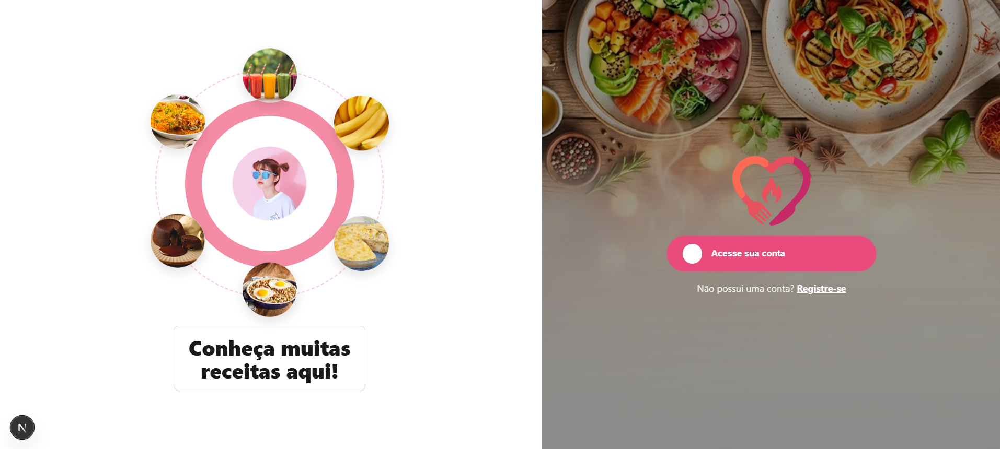

# Smash or Pass

#### Video Demo: https://youtu.be/u6gNtyVILso

#### Description:



## 📌 Description

**Smash or Pass** is a web application inspired by the Tinder interaction model, applied to the culinary domain.

The platform allows users to discover new recipes through simple interest (**Smash**) or disinterest (**Pass**) interactions, as well as register, manage, and share their own recipes.

The project was developed as the final assignment for the Web Software Development course, applying concepts of:

- Client-Server Architecture
- REST APIs
- Authentication and Authorization
- Data Persistence
- Software Documentation
- Full Stack Development

---

## 🎯 Objective

To develop a complete web application composed of frontend, backend, and database, demonstrating good software development and documentation practices.

---

## ⚙️ Main Features

### 🔐 Authentication

- User registration
- JWT login
- Role-based access control (RBAC)

### 🍽️ Recipes

- Recipe registration
- Editing own recipes
- Deleting own recipes
- Image upload
- Content moderation

### 🔥 Smash or Pass

- Like recipes (Smash)
- Reject recipes (Pass)
- Undo last interaction
- Prioritization of recipes not yet evaluated

### 💬 Comments

- Comment creation
- Editing own comments
- Deleting own comments

### 🏷️ Catalog

- Categories
- Ingredients
- Dietary preferences
- Allergens

### 🛠️ Administration

- Recipe approval
- Ingredient approval
- Category approval
- Administrative dashboard

---

## 📚 Documentation

All project documentation is located in the `docs/` folder.

### Architecture

| Document                             | Description                    |
|--------------------------------------|--------------------------------|
| `docs/architecture/erd.md`           | Entity-relationship model      |
| `docs/architecture/business-rules.md`| Business rules                 |
| `docs/architecture/enums.md`         | System enums                   |
| `docs/architecture/conventions.md`   | Architectural conventions      |

### Database

| Document                        | Description                           |
|----------------------------------|---------------------------------------|
| `docs/database/prisma-schema.md` | Database structure and Prisma mapping |
| `docs/database/indexes.md`       | Indexes and optimizations             |

### API

| Document                    | Description                 |
|----------------------------|-----------------------------|
| `docs/api/authentication.md` | Authentication and authorization |
| `docs/api/users.md`          | User endpoints              |
| `docs/api/recipes.md`        | Recipe endpoints            |
| `docs/api/interactions.md`   | Smash/Pass endpoints        |
| `docs/api/comments.md`       | Comment endpoints           |
| `docs/api/moderation.md`     | Administrative endpoints    |
| `docs/api/dashboard.md`      | Dashboard and metrics       |

---

## 🧱 Architecture

The system follows the **Client-Server** model, divided into two independent applications.

**Backend:**

Main technologies:

- Node.js
- TypeScript
- Express
- Prisma ORM
- PostgreSQL
- JWT
- Bcrypt
- Swagger/OpenAPI

Layered architecture:

```text
Routes
  ↓
Controllers
  ↓
Services
  ↓
Repositories
  ↓
Database
```

**Frontend:**

Technologies:

- React
- TypeScript
- Axios
- React Router

Architecture based on reusable components.

---

## 🛠️ Technologies Used

**Backend:**

- Node.js
- TypeScript
- Express
- Prisma ORM
- PostgreSQL
- JWT
- Bcrypt
- Swagger/OpenAPI

**Frontend:**

- React
- TypeScript
- Axios

### Tools

- Git
- GitHub
- Trello
- Excalidraw

---

## 🚀 How to Run

### Prerequisites

- Node.js
- PostgreSQL

---

**Backend:**

```bash
cd backend

npm install

npx prisma migrate dev

npx prisma db seed

npm run dev
```

Backend available at:

```text
http://localhost:3000
```

Swagger available at:

```text
http://localhost:3000/docs
```

---

**Frontend:**

```bash
cd frontend

npm install

npm run dev
```

Frontend available at:

```text
http://localhost:5173
```

---

## 📁 Project Structure

```text
smash-or-pass/
│
├── backend/
│   ├── prisma/
│   ├── src/
│   │   ├── routes/
│   │   ├── controllers/
│   │   ├── services/
│   │   ├── repositories/
│   │   ├── middlewares/
│   │   ├── validations/
│   │   ├── utils/
│   │   └── config/
│
├── frontend/
│   ├── src/
│   │   ├── components/
│   │   ├── pages/
│   │   ├── services/
│   │   ├── hooks/
│   │   ├── contexts/
│   │   └── routes/
│
├── docs/
│   ├── architecture/
│   ├── api/
│   └── database/
│
└── README.md
```

---

## 📊 Project Status

**In development.**

---

## 👨‍💻 Team

- [Arthur Vinicius Carneiro Nunes](https://github.com/ArthurViniNunes)
- [João Igor Almeida Gomes](https://github.com/Igoxrx)
- [Marcos Antonio Alencar da Rocha Junior](https://github.com/mirkojr)
- [Samyra Vitória Lima de Almeida](https://github.com/samyraalmeida)

---

## 🤝 Contribution

Before making changes to the project, consult:

- `CONTRIBUTING.md`

---

## 📄 License

This project is licensed under the [MIT License](LICENSE).
