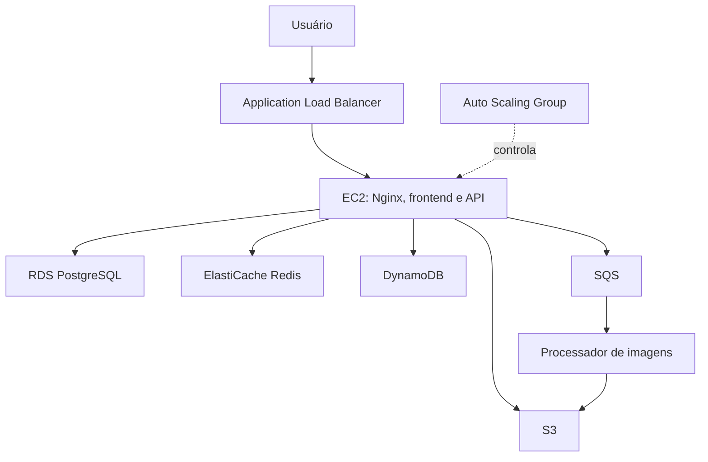
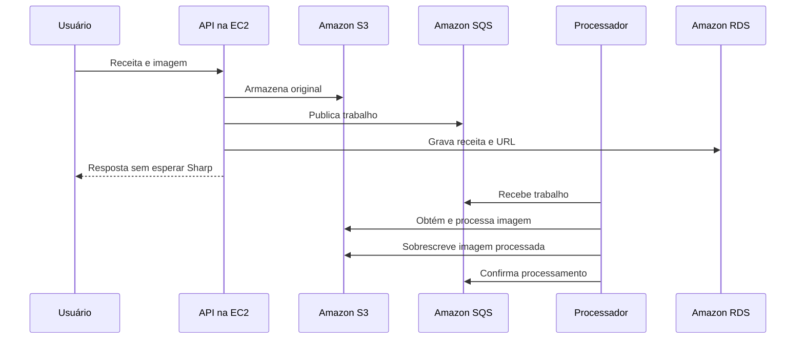
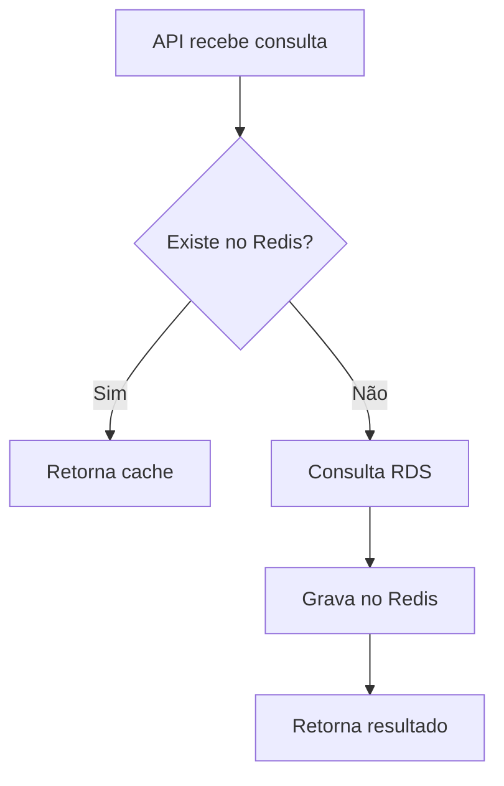

# Arquitetura AWS - Smash or Pass

## 1. Objetivo deste documento

Este documento explica como e por que cada recurso da AWS é utilizado na adaptação do **Smash or Pass** para o trabalho de Desenvolvimento de Software para Nuvem.

O sistema original já possuía frontend, API REST, autenticação, regras de negócio, upload de imagens e persistência PostgreSQL. A adaptação para nuvem preserva essas funcionalidades e distribui responsabilidades entre serviços gerenciados da AWS.

Os objetivos principais são:

- executar a aplicação em infraestrutura de nuvem;
- separar dados relacionais, arquivos, cache e auditoria;
- processar imagens de maneira assíncrona;
- suportar aumento e redução horizontal de capacidade;
- demonstrar tolerância a falhas e baixo acoplamento;
- atender integralmente aos requisitos das partes 1 e 2 do trabalho.

## 2. Visão geral



## 3. Resumo dos serviços

| Serviço | Responsabilidade no projeto |
| --- | --- |
| Amazon EC2 | Executar Nginx, frontend Next.js, API Node.js e processador de imagens |
| Amazon RDS para PostgreSQL | Armazenar os dados relacionais e transacionais |
| Amazon S3 | Armazenar imagens de receitas e avatares |
| Amazon ElastiCache para Redis | Acelerar consultas frequentes de receitas |
| Amazon DynamoDB | Registrar as ações de CRUD para auditoria |
| Amazon SQS | Desacoplar o recebimento e o processamento das imagens |
| Application Load Balancer | Distribuir requisições entre instâncias saudáveis |
| Auto Scaling Group | Ajustar a quantidade de instâncias EC2 entre 1 e 3 |

## 4. Amazon EC2

### O que é

O EC2 fornece máquinas virtuais na AWS. Essas máquinas são chamadas de instâncias.

### Como será usado

Cada instância executará quatro contêineres:

1. **Nginx** na porta 80, como entrada única;
2. **frontend Next.js** na porta interna 5173;
3. **API Node.js/Express** na porta interna 3000;
4. **processador de imagens**, que consome mensagens do SQS.

Somente o Nginx receberá tráfego encaminhado pelo balanceador. Os demais contêineres permanecerão acessíveis apenas na rede interna do Docker.

### Por que foi escolhido

- é um requisito explícito do trabalho;
- permite executar a aplicação completa;
- é compatível com Docker e Docker Compose;
- pode ser replicado pelo Auto Scaling;
- possibilita utilizar a mesma configuração em todas as instâncias.

### Decisão importante

A aplicação não dependerá de arquivos locais gerados em execução. As imagens ficarão no S3 e os dados no RDS, permitindo que qualquer instância responda às requisições.

## 5. Amazon RDS para PostgreSQL

### O que é

O RDS é um serviço gerenciado de bancos de dados relacionais. A AWS cuida da infraestrutura do banco, enquanto a aplicação continua utilizando PostgreSQL normalmente.

### Como será usado

O RDS armazenará:

- usuários e papéis;
- receitas;
- categorias e ingredientes;
- preferências alimentares e alergênicos;
- comentários;
- interações Smash e Pass;
- estados de moderação;
- relacionamentos entre as entidades.

O Prisma continuará sendo o mapeador objeto-relacional. A principal alteração será apontar `DATABASE_URL` e `DIRECT_URL` para o endpoint do RDS.

### Por que foi escolhido

- os dados possuem relacionamentos fortes;
- o sistema exige transações e integridade referencial;
- o projeto já utiliza PostgreSQL e Prisma;
- evita manter o banco dentro da EC2;
- todas as instâncias compartilham a mesma base.

### O que não será armazenado no RDS

- conteúdo binário das imagens;
- registros de auditoria do CRUD;
- dados temporários de cache.

O RDS guardará somente a URL da imagem armazenada no S3.

## 6. Amazon S3

### O que é

O S3 é um serviço de armazenamento de objetos, adequado para arquivos como imagens, documentos e vídeos.

### Como será usado

O S3 armazenará:

- imagens das receitas;
- avatares dos usuários;
- metainformação indicando se a imagem já foi processada.

Estrutura lógica dos objetos:

```text
smash-or-pass/
  recipes/
    <identificador>.<extensão>
  avatars/
    <identificador>.<extensão>
```

### Fluxo de upload

1. A API recebe o arquivo em memória.
2. O provedor S3 gera um nome único.
3. O arquivo é enviado ao bucket com `processed=false`.
4. A URL do objeto é devolvida para a camada de negócio.
5. A aplicação publica uma mensagem no SQS.

### Por que foi escolhido

- é um requisito do trabalho para arquivos binários;
- evita perder imagens quando uma EC2 é removida;
- todas as instâncias acessam os mesmos arquivos;
- não depende do disco local da máquina;
- possui alta durabilidade e integração nativa com os SDKs da AWS.

### Tratamento de falha

Se o envio ao S3 funcionar, mas a publicação no SQS falhar, a aplicação remove o objeto recém-criado para evitar arquivo órfão.

## 7. Amazon SQS

### O que é

O SQS é um serviço de filas. Um componente envia mensagens e outro componente as consome de forma independente.

### Como será usado

A API publicará mensagens no seguinte formato:

```json
{
  "bucket": "nome-do-bucket",
  "key": "smash-or-pass/recipes/arquivo.jpg",
  "mimeType": "image/jpeg"
}
```

O processador:

1. consulta a fila com espera longa;
2. recebe a mensagem;
3. baixa a imagem do S3;
4. redimensiona a imagem para o limite de 1024 por 1024 pixels;
5. compacta a imagem conforme JPEG, PNG ou WebP;
6. substitui o objeto no S3;
7. marca o objeto com `processed=true`;
8. exclui a mensagem somente após o sucesso.

### Por que foi escolhido

- atende ao requisito de desacoplamento;
- a requisição web não espera o processamento com Sharp;
- falhas temporárias podem ser repetidas;
- várias instâncias podem consumir a mesma fila;
- o SQS evita que duas instâncias processem simultaneamente a mesma mensagem visível.

### Repetição segura

O SQS oferece entrega pelo menos uma vez. Uma mensagem pode, eventualmente, ser entregue novamente. Antes de processar, o worker verifica `processed=true`. Se a imagem já estiver pronta, não realiza nova compressão e apenas conclui a mensagem.

### Fila de mensagens com erro

Será criada uma fila secundária de mensagens com erro. Após repetidas falhas, a mensagem será transferida para essa fila para análise, evitando repetição infinita.

## 8. Amazon DynamoDB

### O que é

O DynamoDB é um banco NoSQL gerenciado, orientado a documentos e chave-valor.

### Como será usado

Um middleware do Express registra as requisições de CRUD:

| Método HTTP | Ação registrada |
| --- | --- |
| POST | CREATE |
| GET | READ |
| PUT ou PATCH | UPDATE |
| DELETE | DELETE |

Exemplo de registro:

```json
{
  "id": "identificador-unico",
  "action": "UPDATE",
  "method": "PATCH",
  "path": "/recipes/123",
  "resource": "recipes",
  "actorId": "usuario-456",
  "requestData": {
    "params": {
      "id": "123"
    },
    "body": {
      "title": "Nova receita"
    }
  },
  "responseStatus": 200,
  "timestamp": "2026-09-22T15:30:00.000Z",
  "durationMilliseconds": 34
}
```

### Proteção de dados sensíveis

Antes da gravação, campos como senha, token, autorização, segredo e chave de acesso são substituídos por `[REDACTED]`.

### Por que foi escolhido

- é uma das opções exigidas pelo trabalho;
- registros de auditoria não precisam de relacionamentos complexos;
- aceita documentos com estruturas flexíveis;
- não aumenta a carga transacional do RDS;
- permite consultar evidências de operação independentemente do banco principal.

### Tabela planejada

```text
Nome: smash-or-pass-audit
Chave de partição: id (String)
Capacidade: sob demanda
```

## 9. Amazon ElastiCache para Redis

### O que é

O ElastiCache fornece um Redis gerenciado em memória. A leitura em memória reduz acessos repetidos ao banco relacional.

### Como será usado

Serão armazenadas em cache:

- listagem de receitas aprovadas;
- consulta de receita aprovada por identificador.

Chaves utilizadas:

```text
recipes:approved:list
recipes:approved:<identificador-da-receita>
```

O tempo de vida será de 300 segundos.

### Estratégia de consulta

1. A API procura o valor no Redis.
2. Se encontrar, devolve o conteúdo sem consultar o RDS.
3. Se não encontrar, consulta o RDS.
4. Grava o resultado no Redis por cinco minutos.
5. Retorna o conteúdo.

### Invalidação

O cache é removido quando ocorre:

- criação de receita;
- edição de receita;
- exclusão de receita;
- aprovação ou rejeição;
- criação, edição ou exclusão de comentário.

### Por que foi escolhido

- é um requisito do trabalho;
- reduz consultas repetidas no RDS;
- melhora o tempo de resposta das telas mais acessadas;
- o conteúdo pode ser reconstruído a partir do RDS;
- se o Redis falhar, a aplicação continua funcionando pelo banco principal.

## 10. Application Load Balancer

### O que é

O Application Load Balancer distribui tráfego HTTP entre múltiplos destinos saudáveis.

### Como será usado

O balanceador:

- receberá as requisições HTTP dos usuários;
- encaminhará o tráfego para a porta 80 das EC2;
- verificará `GET /health`;
- retirará temporariamente destinos sem saúde;
- distribuirá tráfego entre instâncias de zonas diferentes.

### Por que foi escolhido

- é necessário para a elasticidade horizontal;
- fornece um endereço único mesmo quando instâncias são criadas ou removidas;
- evita acesso direto às EC2;
- trabalha integrado ao Auto Scaling Group.

## 11. Auto Scaling Group

### O que é

O Auto Scaling Group mantém e ajusta automaticamente um conjunto de instâncias EC2 baseado em regras.

### Configuração do trabalho

```text
Capacidade mínima: 1
Capacidade desejada: 1
Capacidade máxima: 3
```

Políticas:

- média de CPU acima de 70% por mais de um minuto: adicionar uma instância;
- média de CPU abaixo de 25% por mais de um minuto: remover uma instância;
- nunca reduzir abaixo de uma instância;
- nunca aumentar acima de três instâncias.

### Como uma nova instância fica pronta

A configuração de inicialização deverá:

1. instalar Docker e Git;
2. obter o repositório;
3. criar o arquivo de variáveis de produção;
4. construir ou obter as imagens da aplicação;
5. iniciar os serviços com Docker Compose;
6. responder com sucesso em `/health`.

Depois disso, o balanceador passa a encaminhar tráfego para a nova instância.

### Por que foi escolhido

- atende à Parte 2 do trabalho;
- demonstra elasticidade horizontal;
- substitui instâncias com falha;
- mantém os limites determinados pela especificação.

## 12. Fluxos integrados

### 12.1 Cadastro de receita com imagem



### 12.2 Consulta de receitas



### 12.3 Auditoria

Todas as ações passam pelo middleware de auditoria. Depois que a resposta é concluída, o middleware registra no DynamoDB o método, a ação, a rota, os dados sanitizados, o usuário, o horário, o código de resposta e a duração.

### 12.4 Elasticidade

O monitoramento de CPU gera alarmes. A política de expansão adiciona uma EC2 quando a média supera 70%. A política de redução remove uma EC2 quando a média fica abaixo de 25%, respeitando os limites de 1 e 3.

## 13. Variáveis de ambiente

| Variável | Finalidade |
| --- | --- |
| `DATABASE_URL` | Conexão do Prisma com o RDS |
| `DIRECT_URL` | Conexão direta usada pelas migrações |
| `JWT_SECRET` | Assinatura dos tokens de autenticação |
| `CORS_ORIGINS` | Origem pública permitida |
| `STORAGE_PROVIDER` | Seleciona `s3` em produção |
| `AWS_REGION` | Região dos serviços AWS |
| `AWS_S3_BUCKET` | Nome do bucket de imagens |
| `AWS_SQS_IMAGE_QUEUE_URL` | Endereço da fila de processamento |
| `AWS_DYNAMODB_AUDIT_TABLE` | Nome da tabela de auditoria |
| `REDIS_URL` | Endereço do ElastiCache |

Credenciais AWS não devem ser gravadas no projeto. Na EC2, o SDK obterá credenciais temporárias por meio do perfil IAM fornecido pelo Learner Lab.

## 14. Segurança e rede

Serão utilizados grupos de segurança separados:

| Grupo | Entrada permitida |
| --- | --- |
| Balanceador | HTTP 80 a partir da internet |
| Aplicação | HTTP 80 somente a partir do balanceador; SSH temporário a partir do IP do responsável |
| Dados | PostgreSQL 5432 e Redis 6379 somente a partir do grupo da aplicação |

RDS e ElastiCache não devem ficar publicamente acessíveis. A aplicação acessará esses serviços dentro da VPC.

## 15. Estratégia de custos

Com o crédito limitado do Learner Lab:

- S3, SQS e DynamoDB serão usados com volume mínimo;
- EC2, RDS, ElastiCache e balanceador existirão somente durante implantação, teste e gravação;
- capacidade inicial do Auto Scaling será uma instância;
- após a demonstração, recursos cobrados serão excluídos explicitamente;
- encerrar a sessão do laboratório não substitui a exclusão dos recursos.

## 16. Evidências para apresentação

O vídeo deve demonstrar:

1. aplicação acessível pelo endereço do balanceador;
2. dados persistidos no RDS;
3. imagem armazenada no S3;
4. mensagem passando pelo SQS;
5. imagem marcada como processada;
6. registro CRUD no DynamoDB;
7. chaves existentes no Redis;
8. grupo iniciando com uma EC2;
9. CPU acima de 70%;
10. criação da segunda EC2;
11. duas instâncias saudáveis no balanceador;
12. redução da carga;
13. retorno para uma instância.

## 17. Situação atual

Já implementado no código:

- provedor de armazenamento S3;
- publicação de mensagens no SQS;
- processador assíncrono com Sharp;
- auditoria de CRUD no DynamoDB;
- cache Redis com expiração e invalidação;
- conexão PostgreSQL compatível com RDS;
- contêineres do frontend, backend e processador;
- Nginx e Docker Compose;
- endpoint de saúde.

Pendente de configuração no ambiente AWS:

- criar e conectar os serviços;
- implantar a primeira EC2;
- criar o balanceador;
- criar o modelo de execução e o Auto Scaling Group;
- configurar alarmes e políticas;
- executar testes integrados;
- gravar a demonstração;
- excluir os recursos cobrados.

## 18. Conclusão

A arquitetura utiliza cada serviço para uma responsabilidade específica. O RDS mantém a consistência transacional, o S3 armazena arquivos, o SQS desacopla processamento, o DynamoDB registra auditoria, o Redis acelera leituras, o EC2 executa a solução, o balanceador distribui tráfego e o Auto Scaling adapta a capacidade.

Essa divisão reduz acoplamento, evita dependência do disco local, permite múltiplas instâncias e fornece evidências claras do uso efetivo dos serviços solicitados.
